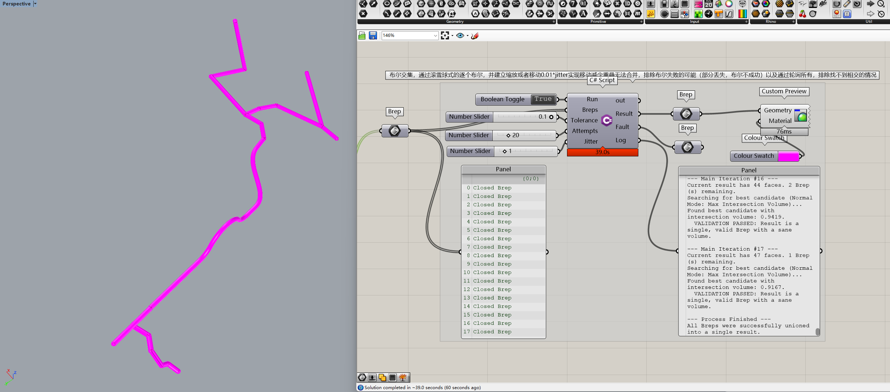

|     | Name      | Description                                                                                                                                                                                                                                                                                                                                                                                                                                                                                                                                                                                                                                                                                                                                                                                                                                                                                                                                                           |
| --- | --------- | --------------------------------------------------------------------------------------------------------------------------------------------------------------------------------------------------------------------------------------------------------------------------------------------------------------------------------------------------------------------------------------------------------------------------------------------------------------------------------------------------------------------------------------------------------------------------------------------------------------------------------------------------------------------------------------------------------------------------------------------------------------------------------------------------------------------------------------------------------------------------------------------------------------------------------------------------------------------- |
| 👉  | Run✱      | Connect `Boolean Toggle`. Since this component runs for a long time, switch it to `true` only when it needs to run. Please note that after clicking “Run,” depending on the complexity, the program may freeze for a period of time. Please wait patiently.                                                                                                                                                                                                                                                                                                                                                                                                                                                                                                                                                                                                                                                                                                           |
| 👉  | Breps✱    | Multiple multi-surface entities requiring Boolean operations                                                                                                                                                                                                                                                                                                                                                                                                                                                                                                                                                                                                                                                                                                                                                                                                                                                                                                          |
| 👉  | Tolerance | Tolerance, If left blank, Rhino's default tolerance will be used. To increase the success rate, increase the tolerance. The range (0.001-x) should not be too large, as this may cause new problems.                                                                                                                                                                                                                                                                                                                                                                                                                                                                                                                                                                                                                                                                                                                                                                  |
| 👉  | Attempts✱ | The number of attempts to adjust after Boolean failure. The recommended value is between 8 and 20. The more attempts, the greater the probability of success, but the longer the waiting time. Based on experience, it usually takes 5-6 attempts to succeed.                                                                                                                                                                                                                                                                                                                                                                                                                                                                                                                                                                                                                                                                                                         |
| 👉  | Jitter✱   | Jitter coefficient: The default input is 1, but the actual deviation is jitter × 0.01, which is the actual spatial random movement distance, or the scaling scale is 1+-jitter ×  0.01. Note that the greater the jitter, the greater the deviation. For small objects, keep the value small to reduce errors.                                                                                                                                                                                                                                                                                                                                                                                                                                                                                                                                                                                                                                                        |
| 🤯  | N/A       | When `Run` is set to `true`, the process begins by randomly selecting a `brep` from the input `Breps` as the starting point. It then proceeds to perform Boolean operations on surrounding objects with intersections in a snowballing manner. The precision of the Boolean operations is determined by `Tolerance`. If a Boolean operation fails, such as when it cannot be successfully performed or results in the loss of surfaces, the process randomly moves by `jitter` * 0.01 or randomly scales by 1 ± `jitter` × 0.01, and attempts `Attempts` times. If it still fails, it usually means the operation can succeed. If all `Attempts` fail, it indicates an issue with detecting intersections, and an alternative detection method is used to iterate through all remaining objects that have not been Booleanized until a successful Boolean operation is achieved, attempting `Attempts` times. Then return to the snowball search method and continue. |
| 👌  | Result    | The result of Boolean operations is a multiple surface solid.                                                                                                                                                                                                                                                                                                                                                                                                                                                                                                                                                                                                                                                                                                                                                                                                                                                                                                         |
| 👌  | Fault     | No Boolean success part, debugging use                                                                                                                                                                                                                                                                                                                                                                                                                                                                                                                                                                                                                                                                                                                                                                                                                                                                                                                                |
| 👌  | Log       | The log is used for debugging analysis and progress assessment.                                                                                                                                                                                                                                                                                                                                                                                                                                                                                                                                                                                                                                                                                                                                                                                                                                                                                                       |

